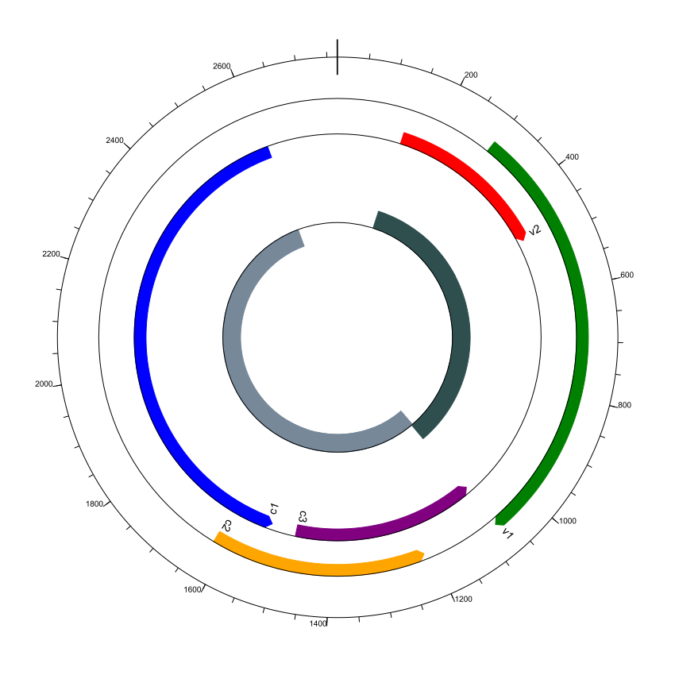

# ACM Research Coding Challenge (Spring 2021)

## Initial Reaction

Prior to this challenge, I had never worked with a genbank file before. I became familiar with the format through an [annotated file](https://www.ncbi.nlm.nih.gov/genbank/samplerecord/) first.

Additionally, I looked at standard circular genome diagrams to get an idea for what I will be creating.

## GenomeDiagram from Biopython

I chose the GenomeDiagram subpackage from Biopython to create my diagram due to my prior experience with Python and the thorough [documentation](https://biopython.org/docs/dev/api/Bio.Graphics.GenomeDiagram.html#module-Bio.Graphics.GenomeDiagram). Also, Biopython has a friendly [tutorial](http://biopython.org/DIST/docs/tutorial/Tutorial.html#sec336) for the subpackage.

## My Initial Solution

I created a basic circular diagram by parsing the genbank file, establishing a track for the diagram with an associated feature set, and reading the gene data into the feature set from the genbank file. Biopython then drew the basic circular diagram.

After I implemented a basic circular diagram, I noticed that the levels were wrong. Genes were overlapping in the diagram, thus making it hard to view the start and endpoints. I created a new track in the diagram and added colors to further differentiate the genes.

## Additions

I revisted this challenge due to being unsatisfied with my initial solution. My initial solution is still in the repository (old_diagram.png).

I was not satisfied with my original solution due to two reasons. First, there was no scale in my diagram, so the size of each gene was ambiguous. Secondly, it showed genes that are overlapping on two different tracks. Although I liked the clarity that came with spreading out the overlapping genes, I wanted to also represent what the overlapping genome looked like.

I first decided to represent the overlapping genome by adding a new center track. I then added features to the track based on a counter variable. Since the first two genes pointed in the same direction, they got the same color. The same process happens with the last three genes, but with a different distinguishing color.

I then added the outside labels to the diagram. I added a new track and set the label size. I was initially going to use biopython to show the units in kilo base pairs, but I stayed with the default labels instead due to the genome size.

Finally, I did some basic reformatting to make the diagram look prettier.

## Diagram

## Resources Used

- GenBank file information: https://www.ncbi.nlm.nih.gov/genbank/samplerecord/#CDSB
- Biopython documentation: https://biopython.org/docs/dev/api/Bio.Graphics.GenomeDiagram.html#module-Bio.Graphics.GenomeDiagram
- Biopython tutorial: http://biopython.org/DIST/docs/tutorial/Tutorial.html#sec336
